# The Monolithic

Webowy klient Git z graficznym interfejsem — historia commitów, gałęzie, staging, push/pull oraz Visual Merge Tool do rozwiązywania konfliktów.

Aplikacja **symuluje** operacje Gita w pamięci (Zustand + mocki). Nie korzysta z prawdziwego repozytorium ani poleceń systemowych — cały stan żyje w store'ach przeglądarki.

---

## Spis treści

- [Zrzuty ekranu aplikacji](#zrzuty-ekranu-aplikacji)
- [Funkcjonalności](#funkcjonalności)
- [Stos technologiczny](#stos-technologiczny)
- [Uruchomienie lokalne](#uruchomienie-lokalne)
- [Konfiguracja integracji](#konfiguracja-integracji)
- [Analityka — Google Analytics 4](#analityka--google-analytics-4)
- [Analityka — Hotjar](#analityka--hotjar)
- [Wdrożenie](#wdrożenie)
- [Struktura projektu](#struktura-projektu)
- [Skrypty npm](#skrypty-npm)

---

## Zrzuty ekranu aplikacji

Zrzuty zapisuj w katalogu `docs/screenshots/`. Poniżej oznaczone miejsca — podmień ścieżki po wklejeniu plików PNG.

### Logowanie i onboarding

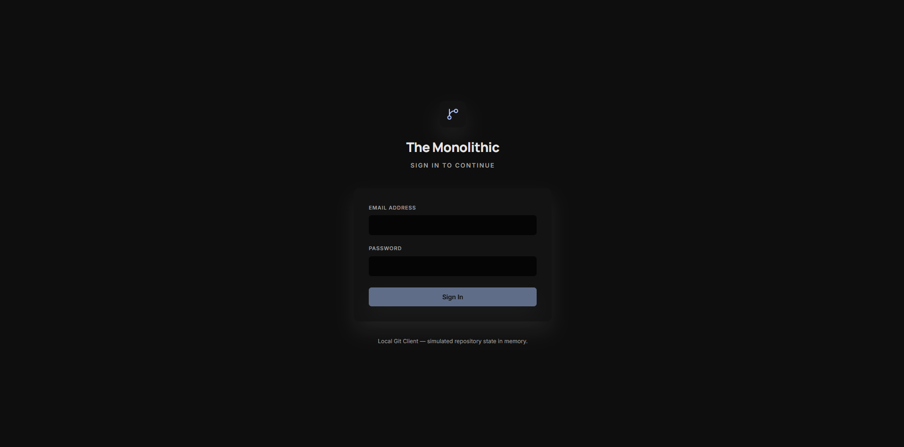

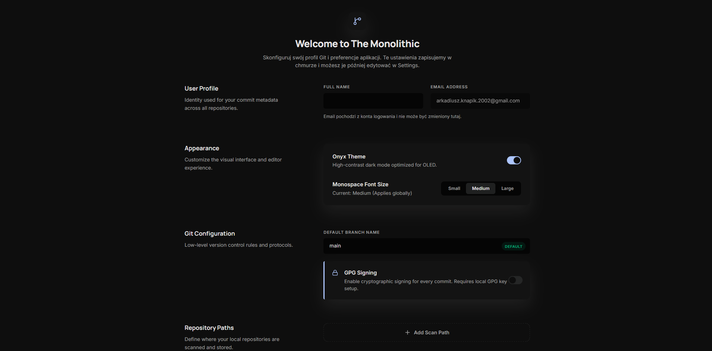

> Widok `/onboarding` — formularz profilu (imię, e-mail, preferencje Git, ścieżki repozytoriów).

### Repositories

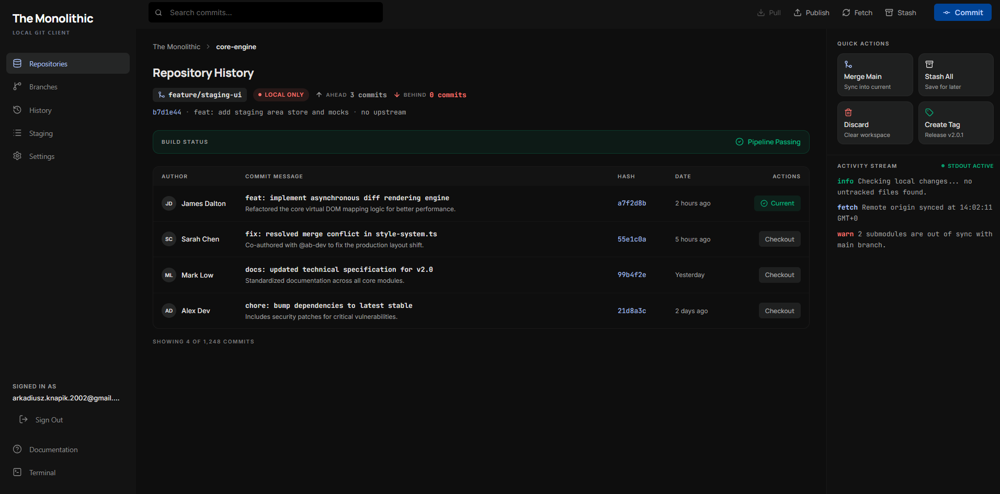

> `/repositories` — toolbar z wyszukiwaniem, status gałęzi (ahead/behind), strumień aktywności.

### Staging

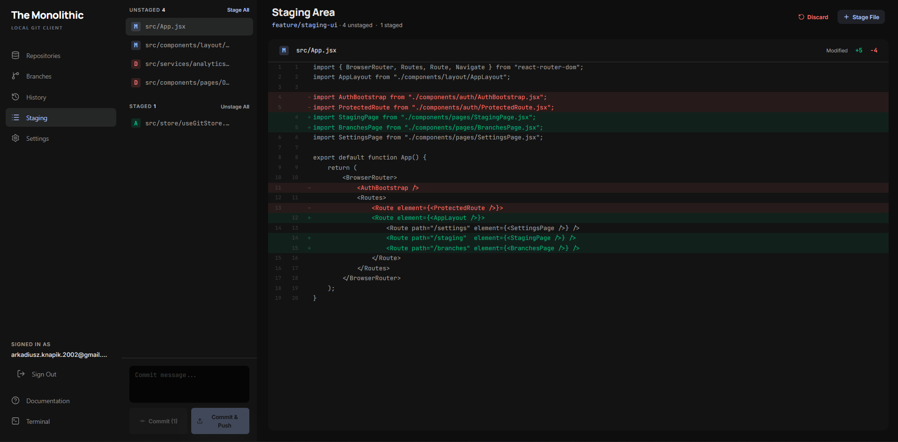

> `/staging` — panele unstaged/staged, podgląd diffa, pole commit message, przyciski Commit / Commit & Push.

### Branches

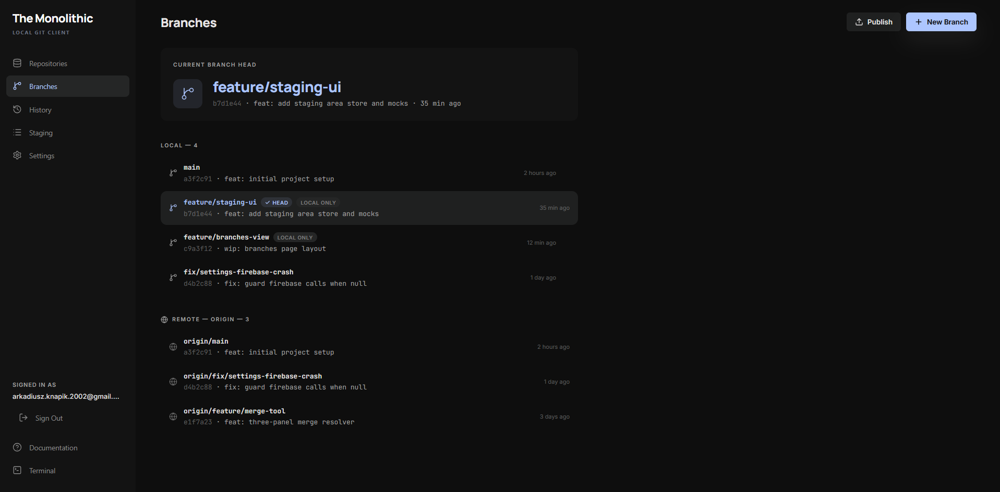
> `/branches` — gałęzie lokalne i remote, wskaźnik HEAD, akcje Push/Pull/Checkout.

### History

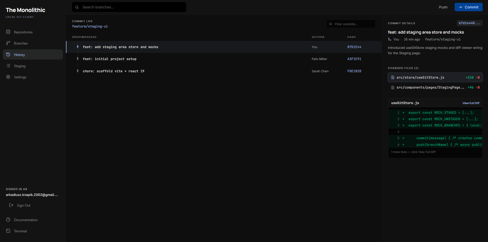

> `/history` — graf commitów, filtr gałęzi, panel szczegółów z diffem wybranego commita.

### Visual Merge Tool
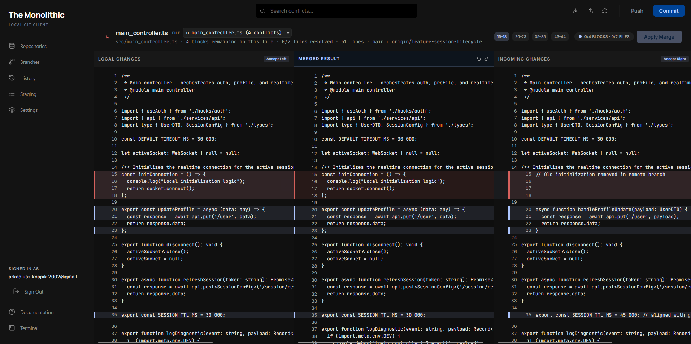

> `/merge` — trzy panele kodu, bloki konfliktów, akcje Accept Left / Accept Right, Apply Merge.

### Settings
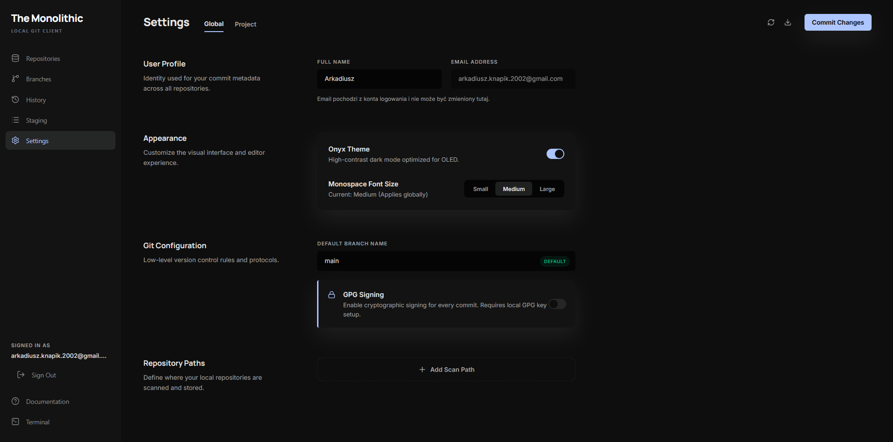

> `/settings` — profil, konfiguracja Git, wygląd (motyw Onyx, rozmiar czcionki), ścieżki repozytoriów.

### Terminal i feedback UI
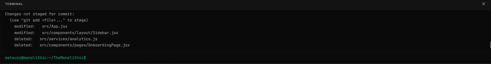

> Panel terminala otwarty z sidebara — symulacja poleceń `git status`, `git log` itd.

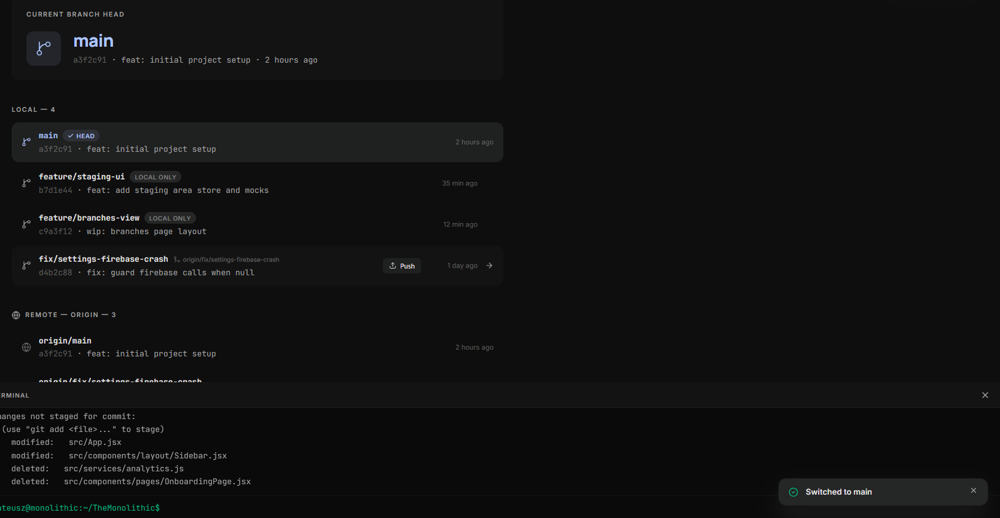

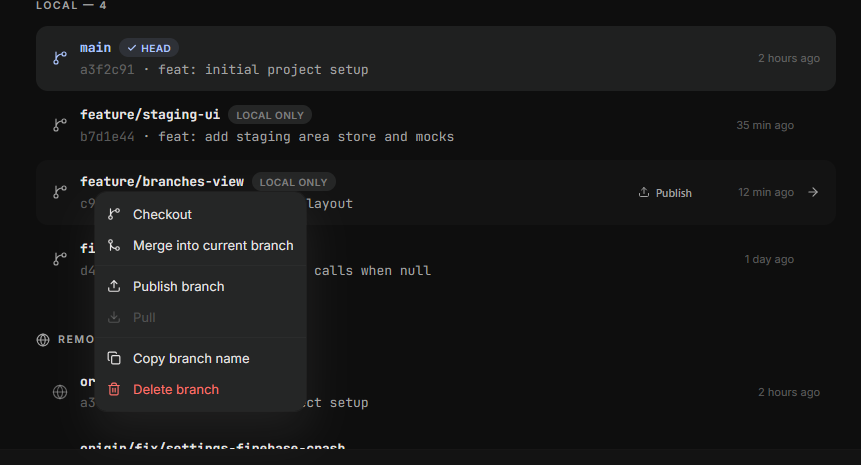
> Toast po akcji (np. Push) oraz menu kontekstowe na gałęzi (PPM).

---

## Funkcjonalności

| Obszar | Co robi w aplikacji |
|--------|---------------------|
| **Autentykacja** | Logowanie e-mail/hasło przez Firebase Auth; trasy chronione poza `/login`. |
| **Onboarding** | Pierwsze logowanie — zapis profilu i preferencji w Firestore, potem redirect do Settings. |
| **Repositories** | Centrum repozytorium: historia commitów, wyszukiwanie, Pull/Push, checkout commita, strumień aktywności. |
| **Staging** | Stage/unstage plików, podgląd diffa, commit na bieżącej gałęzi, Commit & Push z symulacją sieci. |
| **Branches** | Gałęzie lokalne i zdalne, checkout, tworzenie gałęzi, publish, pull, usuwanie; menu kontekstowe (PPM). |
| **History** | Graf historii wybranej gałęzi, filtrowanie commitów, szczegóły i diff w panelu bocznym. |
| **Visual Merge Tool** | Trójpanelowy edytor konfliktów (Ours / wynik / Theirs); push może otworzyć merge przy konflikcie w `App.jsx` lub `Sidebar.jsx`. |
| **Settings** | Edycja profilu i ustawień Git zapisanych w Firestore (motyw Onyx, domyślna gałąź, GPG, ścieżki repo). |
| **Documentation** | Wbudowany przewodnik po workflow (`/docs`) z linkami do poszczególnych widoków. |
| **Terminal** | Dolny panel z symulowanymi poleceniami Git (bez dostępu do systemu plików). |
| **UI globalne** | System toastów (akcje async) i menu kontekstowego dostępne w całej aplikacji. |

**Symulator Git:** operacje `stage`, `commit`, `checkout`, `push`, `pull`, `fetch` działają na mockowanych danych w `useGitStore` i powiązanych store'ach. `push`/`pull` mają opóźnienie sieciowe (`networkStatus`: `idle` \| `pushing` \| `pulling`).

---

## Stos technologiczny

| Warstwa | Biblioteki |
|---------|------------|
| UI | React 19, React Router DOM 7, Tailwind CSS 4, lucide-react |
| Stan | Zustand 5 |
| Auth / profil | Firebase Auth + Firestore |
| Analityka | react-ga4 (GA4), @hotjar/browser |
| Build | Vite 8 |

Design system **„The Architectural Stream”** — ciemny motyw Onyx, tokeny kolorów w `src/index.css`, fonty Manrope / Inter / JetBrains Mono.

---

## Uruchomienie lokalne

### Wymagania

- Node.js 18+
- npm

### Kroki

```bash
git clone <url-repozytorium>
cd TheMonolithic
npm install
cp .env.example .env   # Windows: skopiuj ręcznie .env.example → .env
# Uzupełnij zmienne VITE_* w pliku .env (patrz sekcja poniżej)
npm run dev
```

Aplikacja domyślnie startuje pod adresem wyświetlanym przez Vite (zwykle `http://localhost:5173`).

### Weryfikacja buildu

```bash
npm run lint
npm run build
npm run preview
```

---

## Konfiguracja integracji

Skopiuj `.env.example` do `.env` i uzupełnij:

| Zmienna | Opis |
|---------|------|
| `VITE_FIREBASE_*` | Konfiguracja projektu Firebase (Auth + Firestore) |
| `VITE_GA_MEASUREMENT_ID` | ID pomiaru GA4 (`G-…`) |
| `VITE_HOTJAR_SITE_ID` | ID witryny Hotjar (liczba) |
| `VITE_HOTJAR_VERSION` | Wersja skryptu Hotjar (domyślnie `6`) |

Bez Firebase aplikacja pokaże ostrzeżenie na ekranie logowania; chronione trasy wymagają poprawnej konfiguracji Auth.

W Firebase Console dodaj domenę lokalną/produkcyjną w **Authentication → Authorized domains** i włącz logowanie **Email/Password**.

---

## Analityka — Google Analytics 4

Inicjalizacja w `src/services/analytics.js`, pageview przy każdej zmianie trasy w SPA (`AnalyticsListener` + `trackPageView`).

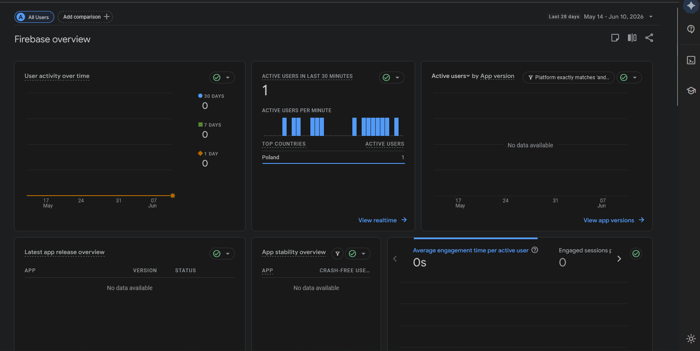

> Raport firebase overview, gdzie widać aktywną sesję użytkownika

---

## Analityka — Hotjar

Hotjar inicjalizowany przez kod hotjar dodany w tagu head jako skrypt 

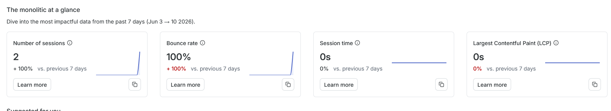

> Panel Hotjar — analityka zebrała dwie sesje.


---

## Wdrożenie

Aplikacja jest hostowana na **[Vercel](https://vercel.com)** — repozytorium GitHub połączone z projektem Vercel, każdy push na gałąź produkcyjną (`main`) uruchamia automatyczny build i podmianę wersji na produkcji.

**Adres produkcyjny:** [URL](https://git-client.vercel.app)

### Konfiguracja na Vercel

| Ustawienie | Wartość |
|------------|---------|
| Framework | Vite (wykrywany automatycznie) |
| Build Command | `npm run build` |
| Output Directory | `dist` |
| Install Command | `npm install` |

Powyższe wartości są również zapisane w `vercel.json` w repozytorium.

### Zmienne środowiskowe

Sekrety (Firebase, GA4, Hotjar) **nie** trafiają do repo — skonfigurowane w panelu Vercel (**Project → Settings → Environment Variables**) dla środowiska Production (oraz Preview, jeśli potrzebne). Nazwy zmiennych jak w `.env.example` — wszystkie z prefiksem `VITE_`, bo Vite wstrzykuje je do bundla w czasie `npm run build`.

Po zmianie zmiennych wymagany jest **Redeploy** (Deployments → ⋮ → Redeploy).

### Routing SPA

Plik `vercel.json` zawiera rewrite wszystkich ścieżek na `index.html`, dzięki czemu React Router obsługuje trasy (`/staging`, `/merge`, `/docs` itd.) także po odświeżeniu strony w przeglądarce.

### Firebase po wdrożeniu

W Firebase Console (**Authentication → Settings → Authorized domains**) dodana jest domena Vercela (np. `*.vercel.app`), żeby logowanie e-mail/hasło działało na produkcji.

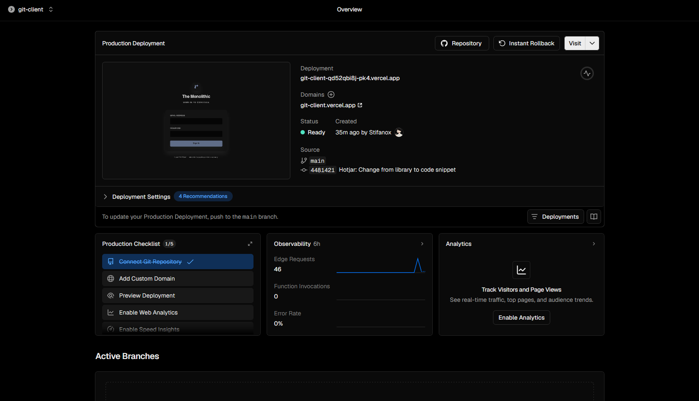

> Dashboard Vercel — projekt The Monolithic/git-client.

---

## Struktura projektu

```
src/
├── App.jsx                 # routing, bootstrap analityki
├── components/
│   ├── pages/              # widoki (Login, Staging, Merge, …)
│   ├── layout/             # AppLayout, Sidebar
│   ├── auth/               # ProtectedRoute, OnboardingGate
│   ├── merge/              # Visual Merge Tool (UI)
│   ├── staging/            # FileRow, DiffViewer
│   ├── history/            # GraphNode, CommitDetails
│   └── ui/                 # TextInput, Modal, Toast, ContextMenu
├── store/                  # Zustand (Git, Merge, Auth, Settings, …)
├── services/               # firebase.js, analytics.js, userProfile.js
└── merge/                  # czysta logika silnika merge
```

Mocki Git i akcje symulatora: `src/store/useGitStore.js`, historia: `useHistoryStore.js`, merge: `useMergeStore.js` + `src/merge/engine.js`.

---

## Skrypty npm

| Polecenie | Opis |
|-----------|------|
| `npm run dev` | Serwer deweloperski Vite |
| `npm run build` | Produkcyjny build do `dist/` |
| `npm run preview` | Podgląd buildu |
| `npm run lint` | ESLint |
